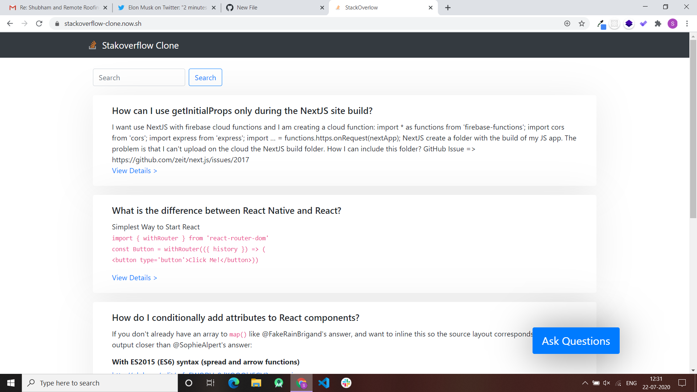
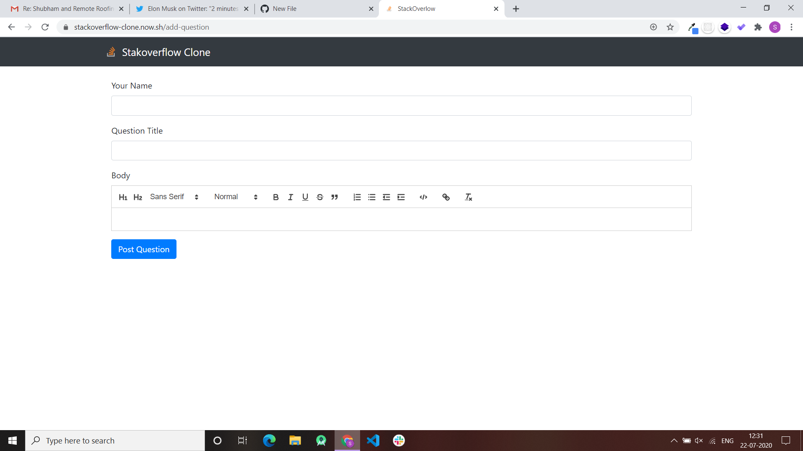
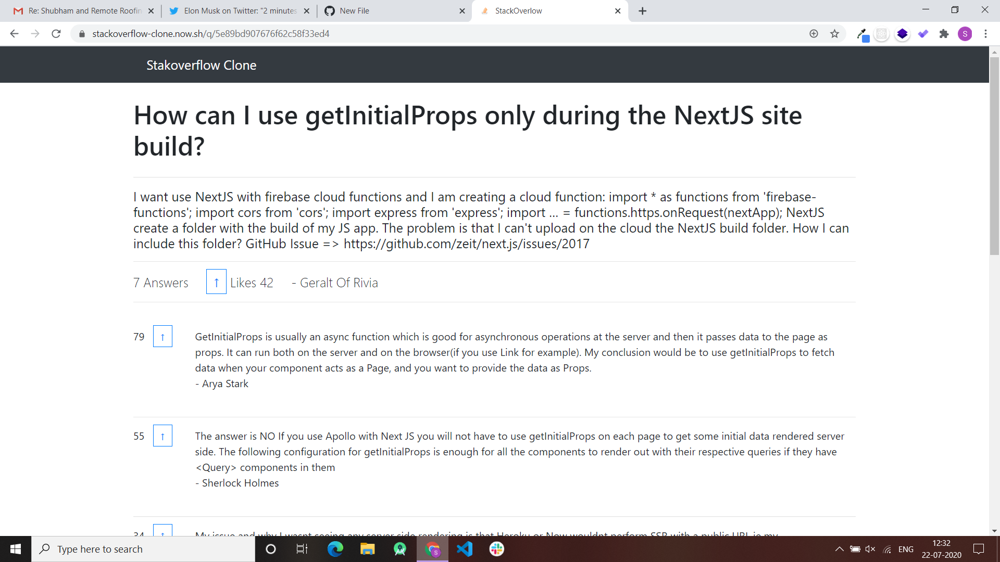

# StackOverflow Clone Using Next.js
URL : https://stackoverflow-clone.now.sh

## Features : 
1. User can ask questions
2. User can view questions
3. User can upvote or downvote a question
4. User can answer question
5. Search for questions, answers and users
6. PWA (Progressive Web App)
7. Server Side Rendering ( Next.js )

## Tech Stack :
 - React
 - Next.js
 - Bootstrap
 - MongoDB
 - now.sh ( Deployment )
 
 ## ScreenShots : 
 
Main Screen : 

New Question : 

Detailed Question : 

